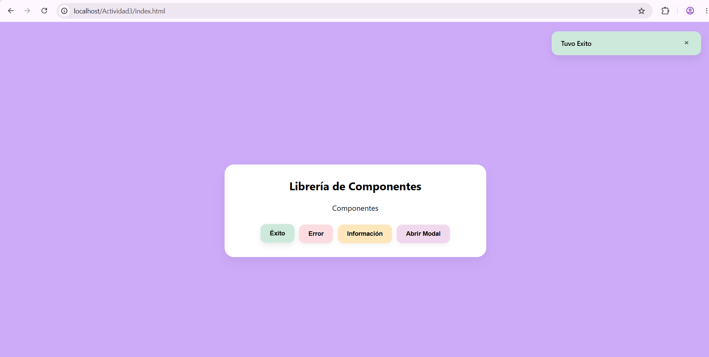
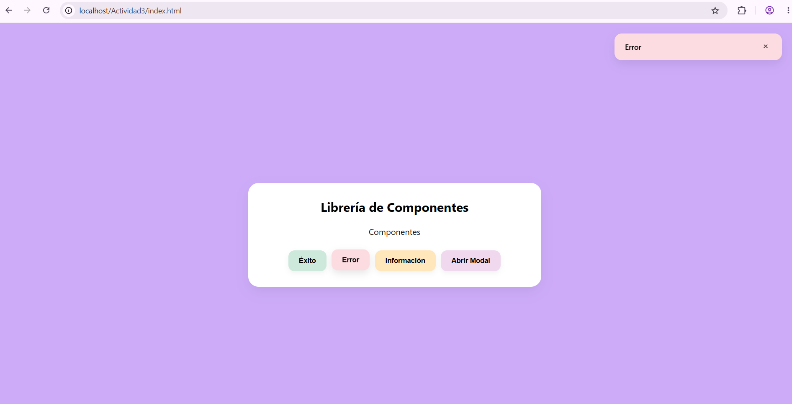
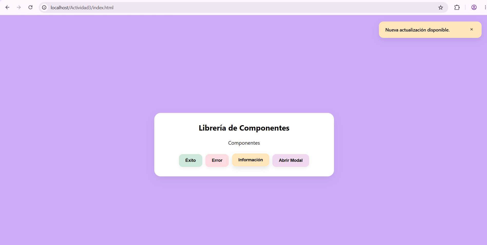
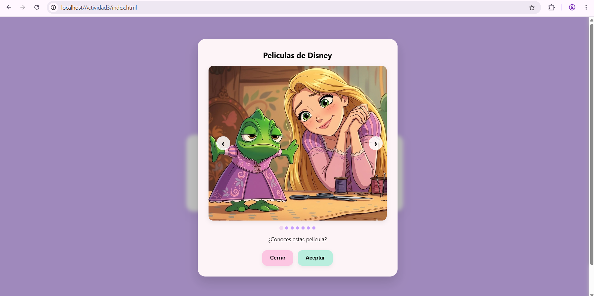

# Componente Visual: Notificaciones Flotantes y Modal con Carrusel de Imagenes

## Portada
* **Nombre:** Evelin Aleida Pablo Delgado
* **Materia:** Programación Web
* **Nombre del componente:** Notificador, modal y carrusel de imagenes
* **Problema que resuelve:** Permite mostrar avisos o alertas al usuario sin interrumpir su navegación ni actualizar la página.Igual nos permite ver un modal donde se muestra un carrusel de imagenes

---

## Instalación

1. Incluye el archivo CSS en la sección `<head>` de tu página HTML:

```html
<link rel="stylesheet" href="css/componente.css">
```

2. Incluye el archivo de JavaScript antes del cierre de la etiqueta `</body>`:

```html
<script src="js/componente.js"></script>
```

---

## Modo de Uso de Notificaciones Flotantes: Ejemplos de Código

Puedes llamar al notificador con distintos parámetros:

### 1. Mensaje de Éxito
```javascript
 notificador.mostrar({ mensaje: 'Tuvo Exito', tipo: 'exito' });
```

### 2. Mensaje de Error
```javascript
notificador.mostrar({ mensaje: 'Error', tipo: 'error' });
```
### 3. Mensaje de Información
```javascript
notificador.mostrar({ mensaje: 'Holi', tipo: 'info' });
```

---

## Capturas de Pantalla de las notificaciones flotantes






---
## Modo de Uso de Notificaciones Flotantes: Ejemplos de Código
Genera una ventana modal dianmica con carrusel navegable con flechas e indicadores.
```javaScript 
modal.abrir({
  titulo: 'Películas de Disney',
  mensaje: '¿Conoces estas películas?',
  imagenes: [
    'img/imagen1.jpg',
    'img/imagen2.jpg',
    'img/imagen3.jpg'
  ],
  alConfirmar: () => {
    notificador.mostrar({
      mensaje: 'Gracias',
      tipo: 'exito',
      duracion: 3500
    });
  }
});
```
---
## Capturas de Pantalla de la ventana Modal con el Carrusel de imagenes



## Video Demostrativo

[Video de demostración](https://www.loom.com/share/118bccc9d9cb44c88192e7b2244c1225).